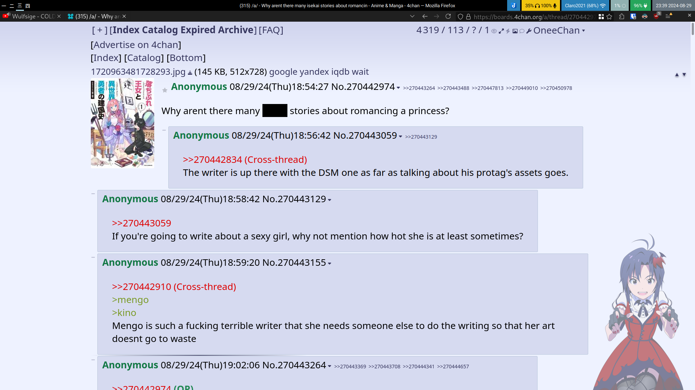
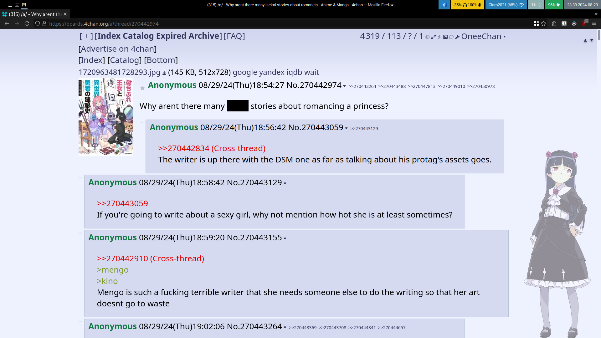

# Firefox user.js and other minor config thinks

I create this repo to save my user.js and other ff configs files

## user.js
> this is not complete and still making test, read the files before using
> check https://github.com/K3V1991/Disable-Firefox-Telemetry-and-Data-Collection

Currently, I'm using a custom-made by me combined [narsil](https://codeberg.org/Narsil/user.js/) and [fastfox from betterfox](https://github.com/yokoffing/BetterFox)

Why I choose narsil over the original arkenfox? Easy because I counter narsil easier to read and better documented, I hear from other people that prefer arkenfox for his docs... idk man i cannot read that.

**Of course i know how all this work!!!**

Now in serious i want a fast experience so fastfox do that, also i want some feature to have better secure and privacy.

I tried before arkenfox.js but this break lot of sites (canvas is the main problem) also the performance is terrible.

Fastfox is fast but i don't really understand even a 1% of all the stuff, maybe i can have better numbers in benchmark doing a lot of test but i don't wanna because it is fucking boring and inconsistent.

So a creation a mix of both, now the performance is better than solo arkenfox, worse than solo fastfox, so is a middle (why? idk).


## Addons

I don't use a lot of addons only the necessary

- [ublock origin - firefox](https://addons.mozilla.org/en-US/firefox/addon/ublock-origin/)
- [bitwarden - firefox](https://addons.mozilla.org/en-US/firefox/addon/bitwarden-password-manager/)
- [dark reader - firefox](https://addons.mozilla.org/en-US/firefox/addon/darkreader/)
- [Offline QR Code Generator - firefox](https://addons.mozilla.org/es/firefox/addon/offline-qr-code-generator/)
	- check src, or just use some luke smith cli to this
- [User-Agent Switcher by Erin Schlarb](https://addons.mozilla.org/en-US/firefox/addon/uaswitcher/)
	- [gitlab](https://gitlab.com/ntninja/user-agent-switcher)
- [User-Agent Switcher and Manager by Ray - FF addons store Recommend](https://addons.mozilla.org/en-US/firefox/addon/user-agent-string-switcher/)
	- [github](https://github.com/ray-lothian/UserAgent-Switcher/)
> i use the made by erin, idk what is the difference or what is better (for yt because google is shit!)

### Others

- [Facebook container - firefox](https://addons.mozilla.org/en-US/firefox/addon/facebook-container/)
- [Firefox Multi-Account Containers - firefox](https://addons.mozilla.org/en-US/firefox/addon/multi-account-containers/)
- [Violentmonkey](https://addons.mozilla.org/en-US/firefox/addon/violentmonkey/)
	- [Violentmonkey git](https://github.com/violentmonkey/violentmonkey)
	- [4chan-xt](https://github.com/TuxedoTako/4chan-xt)
	- [OneeChan](https://github.com/KevinParnell/OneeChan)
	- [bypass-all-shortlinks-debloated](https://codeberg.org/Amm0ni4/bypass-all-shortlinks-debloated/)

### Themes

- [Matte Black by Elijah Lopez - firefox](https://addons.mozilla.org/en-US/firefox/addon/matte-black-v1/)
- [Firefox-UI-Fix](https://github.com/black7375/Firefox-UI-Fix)

About my visual themes...
Well i updated to the last update and i made minor changes, the firts build i was using a oneliner.css that dosent work well on wayland (urlbar on left, tabs on right), the second build now in wayland i was using the options from black7375 (urlbar on righ, tabs on left) which is not very confortable but my memory muscle get it (yeah i know that i can chagen that in that time but i was really dumb <still very today 草>), now in this 3th build i disable the oneliner option because with a few tabs my mind block itseft if i dont see a lot of tabs all on the screan (that and my small screen and res 14"@1080p) make me feel not confortable (yeah i know im gay).

I leave two img



---



## Firefox UI Fix little install guide

to install go to the profile root directory usually in `~/.mozila/firefox/xxxx.profilename`, then clone the repo selecting which branch you want into a directory named chrome (that is what the commands bellow do), now copy chrome/user.js file to the root directory or copy all the content into your user.js if you already have some setting there.
Why i explain this? Because the doc is a mess not really easy to read (or maybe I'm fucking dumb idk) and of course check the wiki for more info.

```sh
# Original Lepton
git clone https://github.com/black7375/Firefox-UI-Fix chrome

# Lepton's photon style
git clone https://github.com/black7375/Firefox-UI-Fix chrome -b photon-style

# Lepton's proton style
git clone https://github.com/black7375/Firefox-UI-Fix chrome -b proton-style
```

I made some change in that user.js (photon style, the new one not the old)

```js
// https://github.com/black7375/Firefox-UI-Fix/wiki/Options#one-liner

user_pref("userChrome.tabbar.one_liner", false);
user_pref("userChrome.tabbar.one_liner.combine_navbar", true);
user_pref("userChrome.tabbar.one_liner.tabbar_first", true);
user_pref("userChrome.tabbar.one_liner.responsive", true);

// https://github.com/black7375/Firefox-UI-Fix/wiki/Options#icons

user_pref("userChrome.icon.library", true);
user_pref("userChrome.icon.panel", false);
user_pref("userChrome.icon.context_menu", false);
user_pref("userChrome.icon.global_menu", false);
user_pref("userChrome.icon.global_menubar", false);

// https://github.com/black7375/Firefox-UI-Fix/wiki/Options#decoration

user_pref("userChrome.decoration.animate", false);
user_pref("userChrome.decoration.disable_panel_animate", true);
user_pref("userChrome.decoration.disable_sidebar_animate", true);

// https://github.com/black7375/Firefox-UI-Fix/wiki/Options#padding

user_pref("userChrome.padding.menu_compact", true);
user_pref("userChrome.padding.bookmark_menu.compact", true);
user_pref("userChrome.padding.panel_header", true);
user_pref("userChrome.padding.urlView_expanding", true);
```

# todo

## user.js
- [ ] check SHUTDOWN & SANITIZING, clear cookies, data and other after shutdown (check white list)
- [ ] set master passwd for firefox (check this later)
- [ ] check OCSP certificates (maybe this is not really useful? idk i just copy and paste from narsil)
- [ ] DoH (idk, learn about this, also check dns settins)
- [ ] set canvas true (a lot of sites have mismatched local zone or have some weird behavior (the timezone, i don't really care)
- [ ] set autoplay on youtube.com (just a minor thing)
- [ ] better docs of all this
- [ ] better readability and organize the .js better
- [ ] find a way to install addons from this repo, copy the files, start ff and boom! all the addons are installed and updated!
- [ ] set customize toolbar... setting at my taste
