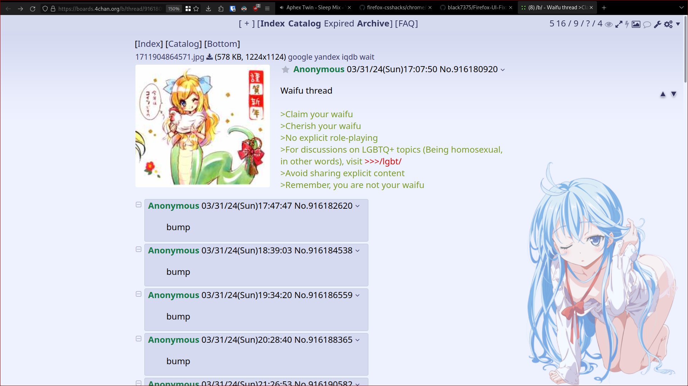
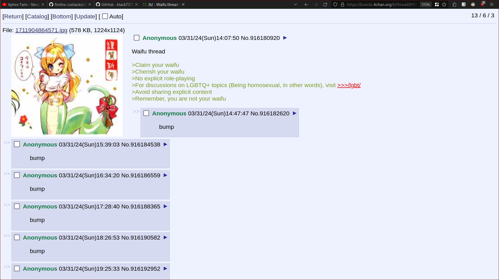

# Firefox user.js and other minor config thinks

I create this repo to save my user.js and other ff configs files

## user.js
> this is not complete and still making test, read the files before using
> check https://github.com/K3V1991/Disable-Firefox-Telemetry-and-Data-Collection

Currently, I'm using a custom-made by me combined [narsil](https://codeberg.org/Narsil/user.js/) and [fastfox from betterfox](https://github.com/yokoffing/BetterFox)

Why I choose narsil over the original arkenfox? Easy because I counter narsil easier to read and better documented, I hear from other people that prefer arkenfox for his docs... idk man i cannot read that.

**Of course i know how all this work!!!**

Now in serious i want a fast experience so fastfox do that, also i want some feature to have better secure and privacy.

I tried before arkenfox.js but this break lot of sites (canvas is the main problem) also the performance is terrible.

Fastfox is fast but i don't really understand even a 1% of all the stuff, maybe i can have better numbers in benchmark doing a lot of test but i don't wanna because it is fucking boring and inconsistent.

So a creation a mix of both, now the performance is better than solo arkenfox, worse than solo fastfox, so is a middle (why? idk).


## Addons

I don't use a lot of addons only the necessary

- [ublock origin - firefox](https://addons.mozilla.org/en-US/firefox/addon/ublock-origin/)
- [bitwarden - firefox](https://addons.mozilla.org/en-US/firefox/addon/bitwarden-password-manager/)
- [dark reader - firefox](https://addons.mozilla.org/en-US/firefox/addon/darkreader/)
- [Offline QR Code Generator - firefox](https://addons.mozilla.org/es/firefox/addon/offline-qr-code-generator/)
	- check src, or just use some luke smith cli to this
- [User-Agent Switcher by Erin Schlarb](https://addons.mozilla.org/en-US/firefox/addon/uaswitcher/)
	- [gitlab](https://gitlab.com/ntninja/user-agent-switcher)
- [User-Agent Switcher and Manager by Ray - FF addons store Recommend](https://addons.mozilla.org/en-US/firefox/addon/user-agent-string-switcher/)
	- [github](https://github.com/ray-lothian/UserAgent-Switcher/)
> i use the made by erin, idk what is the difference or what is better (for yt because google is shit!)

### Others

- [Facebook container - firefox](https://addons.mozilla.org/en-US/firefox/addon/facebook-container/)
- [Firefox Multi-Account Containers - firefox](https://addons.mozilla.org/en-US/firefox/addon/multi-account-containers/)
- [Violentmonkey](https://addons.mozilla.org/en-US/firefox/addon/violentmonkey/)
	- [Violentmonkey git](https://github.com/violentmonkey/violentmonkey)
	- [4chan-xt](https://github.com/TuxedoTako/4chan-xt)
	- [OneeChan](https://github.com/KevinParnell/OneeChan)

### Themes

- [Matte Black by Elijah Lopez - firefox](https://addons.mozilla.org/en-US/firefox/addon/matte-black-v1/)
- [Firefox-UI-Fix](https://github.com/black7375/Firefox-UI-Fix)
- [Firefox-CSSHacks](https://github.com/MrOtherGuy/firefox-csshacks/)
	- [navbar_tabs_responsive_oneliner.css](https://github.com/MrOtherGuy/firefox-csshacks/blob/master/chrome/navbar_tabs_responsive_oneliner.css)
	> have bugs, fullscreen, and wayland session (or ar least in hyprland)

About my visual themes... lest say my 'old' visual config was the black7375 proton-syle (a2a866c49af958d9a350ae403cd10a74a294629e) and the navbar tab oneline.
I tried to recreate using the last update of black7375 and that CSS (same commit last update 2023-05-13 8aab757) but this time using photon style and adding some pref i found in the wiki to look like that CSS.
Well the visual are different, dint tried the navbar oneliner, only the preff.
I leave two img



---



Mph yup, and i don't know how to make the new one look a like the old, the tabs are difficult to see, and the urlbar is on the right...
So by the moment i leave like that.
I leave the files in this repo for you, maybe you are a genius and can help me!!
> After almost a month I got used to this layout, it is not as annoying as before, but it would be good to know how to modify all this


## Firefox UI Fix little install guide

It's simple, go to the profile root directory, then clone the repo (select the branch you like) in a directory named chrome, copy the user.js from chrome to the root directory, easy.
Why i explain this? Because the doc is a mess not really easy to read (or maybe I'm fucking dumb idk) and of course check the wiki for more info.

```sh
# Original Lepton
git clone https://github.com/black7375/Firefox-UI-Fix chrome

# Lepton's photon style
git clone https://github.com/black7375/Firefox-UI-Fix chrome -b photon-style

# Lepton's proton style
git clone https://github.com/black7375/Firefox-UI-Fix chrome -b proton-style
```


I made some change in that user.js (photon style, the new one not the old)

```js
// https://github.com/black7375/Firefox-UI-Fix/wiki/Options#one-liner

user_pref("userChrome.tabbar.one_liner", false);
user_pref("userChrome.tabbar.one_liner.combine_navbar", true);
user_pref("userChrome.tabbar.one_liner.tabbar_first", true);
user_pref("userChrome.tabbar.one_liner.responsive", true);

// https://github.com/black7375/Firefox-UI-Fix/wiki/Options#icons

user_pref("userChrome.icon.library", true);
user_pref("userChrome.icon.panel", false);
user_pref("userChrome.icon.context_menu", false);
user_pref("userChrome.icon.global_menu", false);
user_pref("userChrome.icon.global_menubar", false);

// https://github.com/black7375/Firefox-UI-Fix/wiki/Options#decoration

user_pref("userChrome.decoration.animate", false);
user_pref("userChrome.decoration.disable_panel_animate", true);
user_pref("userChrome.decoration.disable_sidebar_animate", true);

// https://github.com/black7375/Firefox-UI-Fix/wiki/Options#padding

user_pref("userChrome.padding.menu_compact", true);
user_pref("userChrome.padding.bookmark_menu.compact", true);
user_pref("userChrome.padding.panel_header", true);
user_pref("userChrome.padding.urlView_expanding", true);
```

# todo

## user.js
- [ ] check SHUTDOWN & SANITIZING, clear cookies, data and other after shutdown (check white list)
- [ ] set browser.urlbar.suggest in private windows
- [ ] set master passwd for firefox (check this later)
- [ ] check OCSP certificates (maybe this is not really useful? idk i just copy and paste from narsil)
- [ ] Doh (idk, learn about this, also check dns settins)
- [ ] set canvas true (a lot of sites have mismatched local zone or have some weird behavior (the timezone, i don't really care)
- [ ] set autoplay on youtube.com (just a minor thing)
- [ ] better docs of all this
- [ ] better readability and organize the .js better
- [ ] find a way to install addons from this repo, copy the files, start ff and boom! all the addons are installed and updated!
- [ ] disable firefox view
- [ ] set customize toolbar... setting at my taste